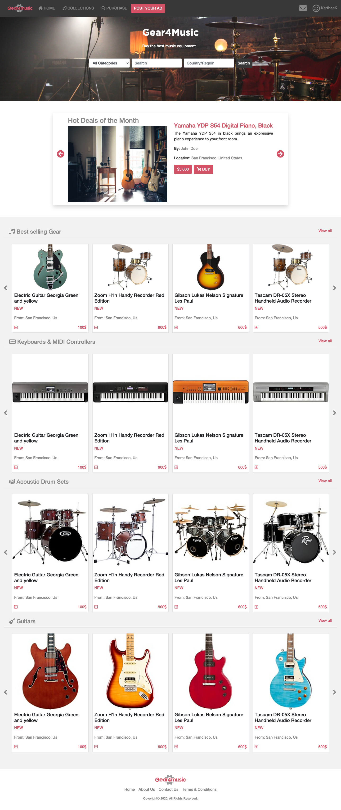
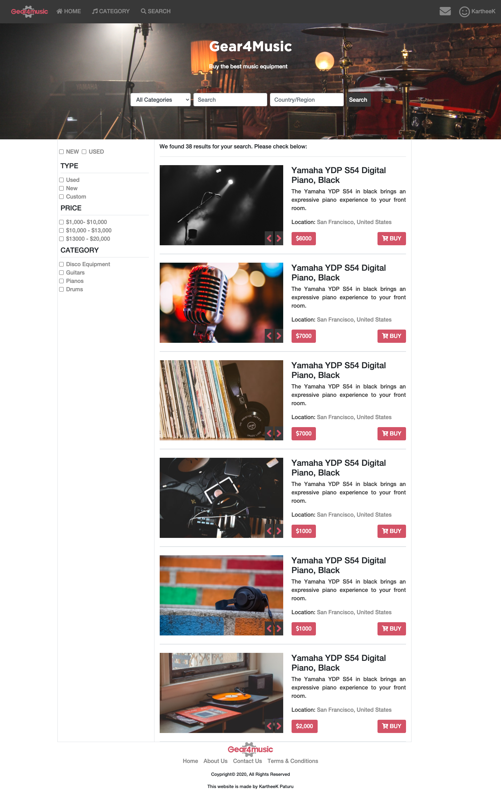

# Online shop (index and search page) 

> This is a capstone project for  module HTML/CSS. It is a Gear4Music website using HTML, CSS3, Bootstrap, and Font awesome.

## The website is built using this [mockup](https://www.behance.net/gallery/24796463/ZATTIX)

## Screenshot of the index page

## Screenshot of the search page

The project is built using HTML and CSS with an extensive use of the grid and flex propreties. 
## Built With

- HTML
- CSS3
- Bootstrap
- Font awesome icons
- Webhint/Stylelint linters
- NPM scripts for testing and running the SCSS changes

## Live Demo

[Live Demo index page](https://gear4music.netlify.app/index.html)

[Live Demo search page](https://gear4music.netlify.app/search.html)

(You can also navigate between pages using the navigation links and the search form.)

## To get a local copy up and running follow these simple example steps.

Run `git clone https://github.com/KartheekWD/HTML-CSS-capstone-project.git` in your terminal and then change directory into the HTML-CSS-capstone-project folder"

### Future improvements

Add a backend to the page

## Authors

👤 **KartheeK Paturu**

- Github: [@KartheekWD](https://github.com/kartheekwd)
- Twitter: [@KartheekWD](https://twitter.com/kartheekwd)
- Linkedin: [KartheekWD](https://www.linkedin.com/in/kartheekwd/)

## Show your support

Give a ⭐️ if you like this project!

## 📝 License

This project is [MIT](lic.url) licensed.
