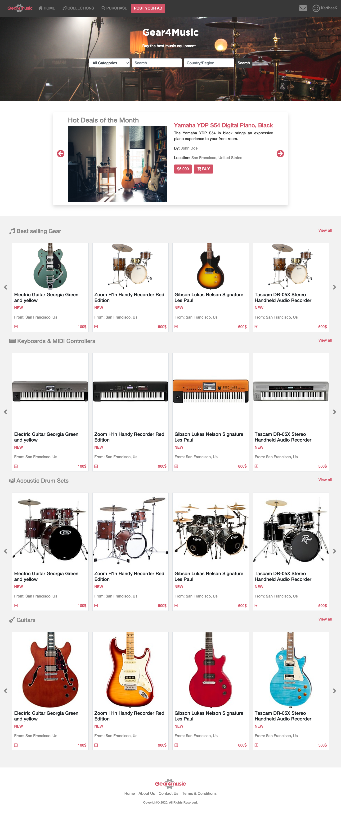
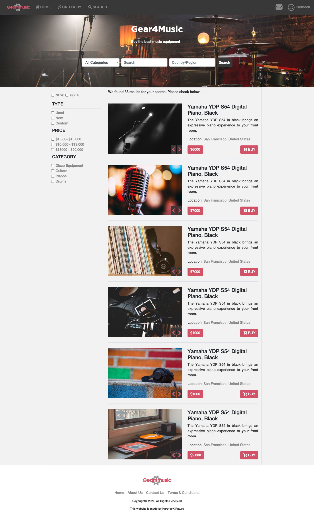

# Online shop (index and search page) 

> This is a capstone/exam project for the [Microverse](https://www.microverse.org) module HTML/CSS. It is a Gear4Music website using HTML, CSS3, Bootstrap, and Font awesome.

## Watch a video presentation of the project [here](https://www.loom.com/share/36ccb168053545768be5f97d5be29a99). The website is built using this [mockup](https://www.behance.net/gallery/24796463/ZATTIX)

## Screenshot of the index page

## Screenshot of the search page

The project is built using HTML and CSS with an extensive use of the grid and flex propreties. 
## Built With

- HTML
- CSS3
- Bootstrap
- Font awesome icons
- Webhint/Stylelint linters
- NPM scripts for testing and running the SCSS changes

## Live Demo

[Live Demo index page](https://rawcdn.githack.com/KartheekWD/HTML-CSS-capstone-project/a50d1b6d1201999a993ac7b8ed134d909a705167/index.html)

[Live Demo search page](https://rawcdn.githack.com/KartheekWD/HTML-CSS-capstone-project/a50d1b6d1201999a993ac7b8ed134d909a705167/search.html)

(You can also navigate between pages using the navigation links and the search form.)

## To get a local copy up and running follow these simple example steps.

### Setup

Clone the project locally.

### Getting Started

To get a local copy of the repository please run the following commands on your terminal:

Run `git clone https://github.com/KartheekWD/HTML-CSS-capstone-project.git` in your terminal and then change directory into the HTML-CSS-capstone-project folder"

### Future improvements

Add a backend to the page

## Authors

👤 **KartheeK Paturu**

- Github: [@KartheekWD](https://github.com/kartheekwd)
- Twitter: [@KartheekWD](https://twitter.com/kartheekwd)
- Linkedin: [KartheekWD](https://www.linkedin.com/in/kartheekwd/)

## Show your support

Give a ⭐️ if you like this project!

## 📝 License

This project is [MIT](lic.url) licensed.